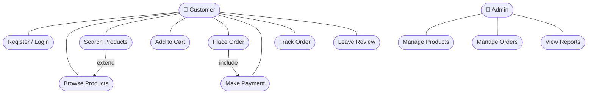
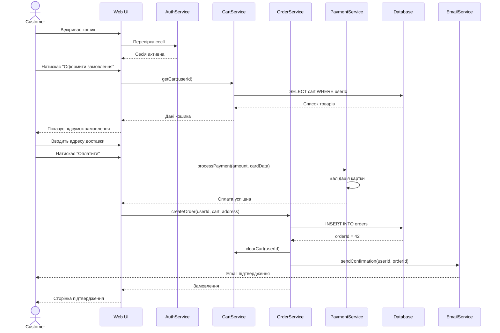
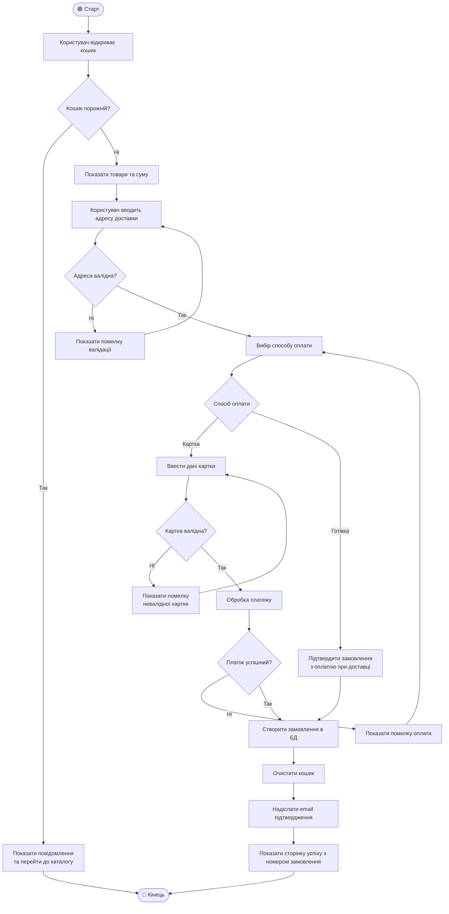

# Practical lesson pz-UML
## Побудова поведінкових UML-діаграм для проєктування інформаційних систем

> Предметна область: **Онлайн-магазин** — система оформлення та оплати замовлень.  
> Інструмент: **Mermaid.js** (вбудований в Markdown на GitHub).

---

## Структура проєкту

```
├── pz-UML
│   ├── diagrams
│   │   ├── use-case.md       # Діаграма варіантів використання
│   │   ├── sequence.md       # Діаграма послідовності
│   │   └── activity.md       # Діаграма діяльності
│   └── README.md
```

---

## Предметна область

Система **онлайн-магазину** дозволяє:
- покупцям переглядати товари, додавати їх у кошик, оформлювати та оплачувати замовлення
- адміністраторам керувати товарами, замовленнями та переглядати звіти

---

## 1. Use Case Diagram — Діаграма варіантів використання

**Призначення:** показує, які дії можуть виконувати різні актори (користувачі) системи та як вони взаємодіють з функціями системи.

**Актори:**
- **Customer** — зареєстрований покупець
- **Admin** — адміністратор магазину



**Пояснення:**
- `Place Order` **включає** `Make Payment` — оформлення замовлення завжди вимагає оплати
- `Search Products` **розширює** `Browse Products` — пошук є опціональним розширенням перегляду

---

## 2. Sequence Diagram — Діаграма послідовності

**Призначення:** показує хронологічну послідовність взаємодій між об'єктами системи при виконанні конкретного сценарію.

**Сценарій:** оформлення замовлення покупцем



**Пояснення:**
- суцільні стрілки (`->>`) — виклики методів
- пунктирні стрілки (`-->>`) — відповіді
- система залучає 6 компонентів: UI, Auth, Cart, Order, Payment, DB, Email

---

## 3. Activity Diagram — Діаграма діяльності

**Призначення:** описує потік керування та логіку процесу з розгалуженнями, умовами та паралельними діями.

**Сценарій:** повний процес оплати замовлення з обробкою помилок



**Пояснення:**
- діаграма охоплює два способи оплати: карткою та готівкою
- передбачено обробку помилок: порожній кошик, невалідна адреса, невалідна картка, помилка платежу
- потік завершується або успішним створенням замовлення, або виходом при порожньому кошику

---

## Зв'язок між діаграмами

| Діаграма | Що показує | Сценарій |
|----------|-----------|----------|
| Use Case | Хто і що може робити в системі | Всі актори та функції |
| Sequence | Як компоненти взаємодіють у часі | Оформлення замовлення |
| Activity | Логіка потоку з умовами та розгалуженнями | Процес оплати |

Всі три діаграми описують одну предметну область — **онлайн-магазин** — але з різних точок зору: функціональної, часової та процесної.

---

## Висновки

- **Use Case Diagram** — найкраща для комунікації з замовником, показує що система робить
- **Sequence Diagram** — незамінна для розробників, показує як компоненти взаємодіють
- **Activity Diagram** — ідеальна для опису бізнес-процесів з розгалуженнями та умовами

---

## Корисні посилання

- [Mermaid.js документація](https://mermaid.js.org/)
- [UML діаграми на DOU](https://dou.ua/forums/topic/40575/)
- [The ultimate guide to UML](https://miro.com/diagramming/what-is-a-uml-diagram/)
