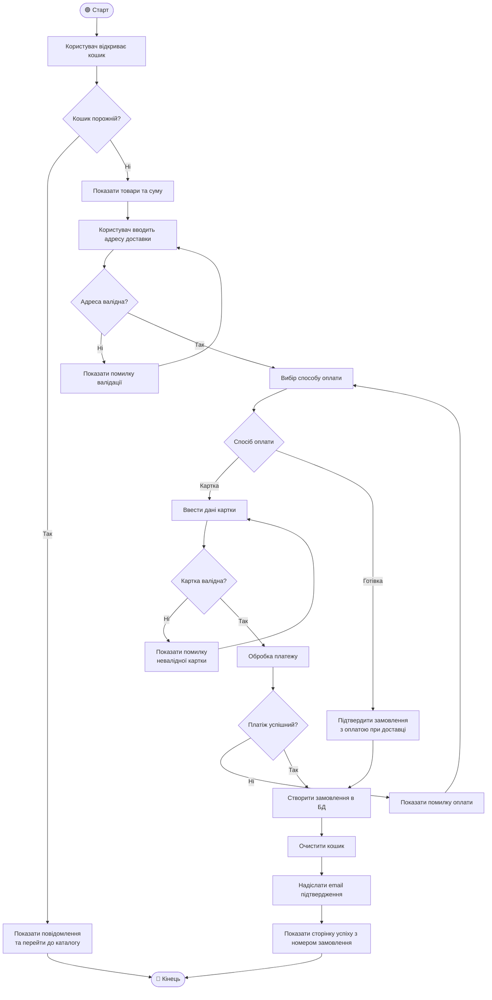

# Activity Diagram — Процес оплати замовлення

```mermaid
flowchart TD
    A([🟢 Старт]) --> B[Користувач відкриває кошик]
    B --> C{Кошик порожній?}
    C -->|Так| D[Показати повідомлення\nта перейти до каталогу]
    D --> Z([🔴 Кінець])

    C -->|Ні| E[Показати товари та суму]
    E --> F[Користувач вводить адресу доставки]
    F --> G{Адреса валідна?}
    G -->|Ні| H[Показати помилку валідації]
    H --> F

    G -->|Так| I[Вибір способу оплати]
    I --> J{Спосіб оплати}

    J -->|Картка| K[Ввести дані картки]
    K --> L{Картка валідна?}
    L -->|Ні| M[Показати помилку\nневалідної картки]
    M --> K
    L -->|Так| N[Обробка платежу]

    J -->|Готівка| O[Підтвердити замовлення\nз оплатою при доставці]
    O --> P

    N --> Q{Платіж успішний?}
    Q -->|Ні| R[Показати помилку оплати]
    R --> I
    Q -->|Так| P[Створити замовлення в БД]

    P --> S[Очистити кошик]
    S --> T[Надіслати email підтвердження]
    T --> U[Показати сторінку успіху з номером замовлення]
    U --> Z
```
