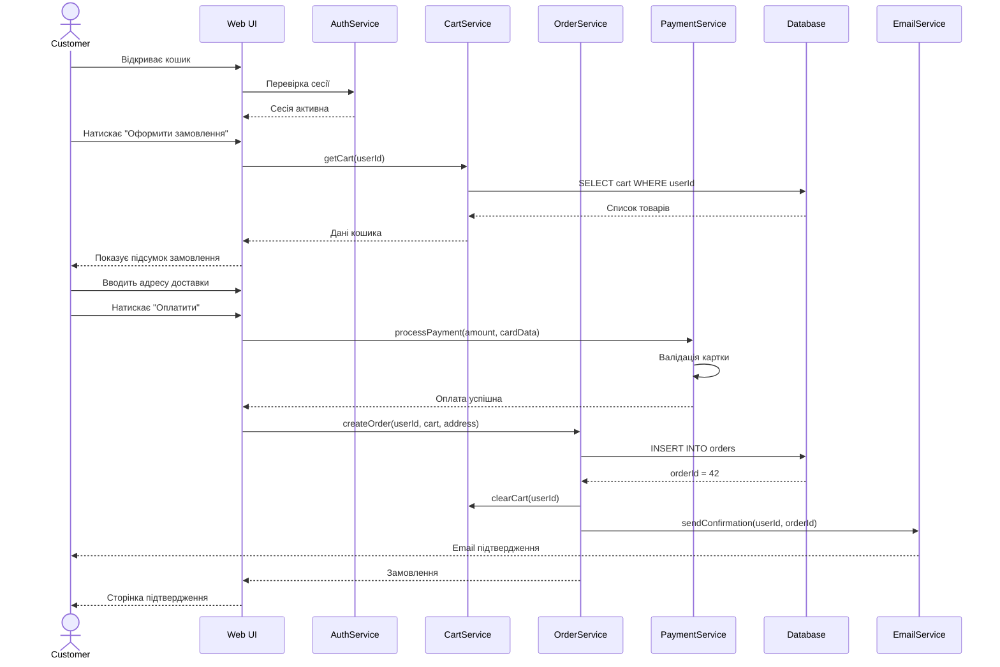

# Sequence Diagram — Процес оформлення замовлення

```mermaid
sequenceDiagram
    actor Customer
    participant UI as Web UI
    participant Auth as AuthService
    participant Cart as CartService
    participant Order as OrderService
    participant Payment as PaymentService
    participant DB as Database
    participant Email as EmailService

    Customer->>UI: Відкриває кошик
    UI->>Auth: Перевірка сесії
    Auth-->>UI: Сесія активна

    Customer->>UI: Натискає "Оформити замовлення"
    UI->>Cart: getCart(userId)
    Cart->>DB: SELECT cart WHERE userId
    DB-->>Cart: Список товарів
    Cart-->>UI: Дані кошика

    UI-->>Customer: Показує підсумок замовлення

    Customer->>UI: Вводить адресу доставки
    Customer->>UI: Натискає "Оплатити"

    UI->>Payment: processPayment(amount, cardData)
    Payment->>Payment: Валідація картки
    Payment-->>UI: Оплата успішна

    UI->>Order: createOrder(userId, cart, address)
    Order->>DB: INSERT INTO orders
    DB-->>Order: orderId = 42
    Order->>Cart: clearCart(userId)
    Order->>Email: sendConfirmation(userId, orderId)
    Email-->>Customer: Email підтвердження

    Order-->>UI: Замовлення #42 створено
    UI-->>Customer: Сторінка підтвердження
```
