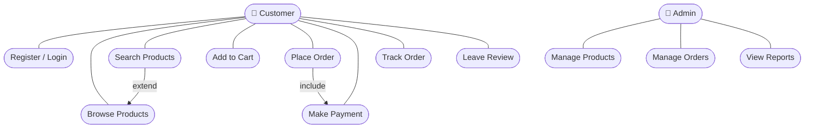

# Use Case Diagram — Онлайн магазин

```mermaid
graph TD
    Customer(["👤 Customer"])
    Admin(["👤 Admin"])

    UC1([Register / Login])
    UC2([Browse Products])
    UC3([Search Products])
    UC4([Add to Cart])
    UC5([Place Order])
    UC6([Make Payment])
    UC7([Track Order])
    UC8([Leave Review])
    UC9([Manage Products])
    UC10([Manage Orders])
    UC11([View Reports])

    Customer --- UC1
    Customer --- UC2
    Customer --- UC3
    Customer --- UC4
    Customer --- UC5
    Customer --- UC6
    Customer --- UC7
    Customer --- UC8

    Admin --- UC9
    Admin --- UC10
    Admin --- UC11

    UC5 -->|include| UC6
    UC3 -->|extend| UC2
```
